# DSO202: Practical 1

## Setting Up a Local Kubernetes Cluster with kind, and Deploying First Workloads


## Objective

The purpose of this practical was to build, from scratch, the local Kubernetes environment that every subsequent practical in DSO202 depends on, and to use that environment to create, inspect, break, and repair five categories of core Kubernetes object: Namespaces with ResourceQuotas and LimitRanges, Pods, Deployments, and Services.

Rather than working with a real application, the practical deliberately used a single static nginx web server throughout, so that the focus stayed on the behaviour of the Kubernetes objects themselves rather than on application code. This let each stage isolate one concept at a time, cluster topology, control-plane components, multi-tenancy primitives, Pod lifecycle, controller-managed workloads, and service discovery, while building toward a single working, self-healing, load-balanced deployment reachable both from inside and outside the cluster.

## 2. Environment

| Component | Version/Detail |
|---|---|
| Operating system | Linux (WSL2 backend used where applicable) |
| Docker Engine / Docker Desktop | 28.1.1 |
| kind | v0.32.0 (go1.24.4, linux/amd64) |
| kubectl (client) | v1.36.0 |
| Kustomize (bundled with kubectl) | v5.7.1 |
| Kubernetes cluster version | v1.36.1 |
| Cluster topology | 1 control-plane node + 2 worker nodes |
| Container runtime | containerd 2.1.4 |
| CNI | kindnet (default) |
| Default StorageClass provider | local-path-storage (added by kind) |

## 3. Procedure and Observations

In this section I have worked through the practical in the order it was performed. Each entry follows the same four-part format: **what was done** (the action and why it was taken), the **command** that was run, the **screenshot** captured as evidence of the output, and **what the output shows** a single sentence interpreting the result.

---

### 3.1 Stage 0: Installing the Required Tools

In this stage, I have installed the required tools for the practical. The tools include Docker, kind, and kubectl. I have also verified the installation of each tool by checking their versions.  

All the required tools were installed successfully, and their versions were verified to be compatible with the practical requirements.

### 3.2 Stage 1: Creating the Three-Node Cluster

**What was done:** Here  I have created the three-node cluster from the configuration file committed at `cluster/kind-cluster.yaml`. I have copied the manifest file from the kind cluster configuration walkthrough and applied the file to create a cluster.

Then I have verified the cluster was created successfully by listing the nodes belonging to it.

**Command:**
```
King get nodes --name dso202
```


**What this shows:** The cluster `dso202` exists and consists of exactly three nodes, one control plane and two workers. I have also the screenshots of the docker container running.

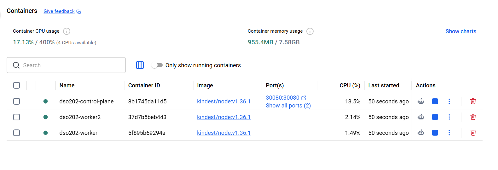

**Step 4**

Confirm the same three nodes as Docker containers.


**What this shows:** Each Kubernetes node is running as a separate Docker container from the `kindest/node` image, all in an `Up` status.

**Step 5**

Confirmed kubectl had been pointed at the correct context without any manual configuration.


**What this shows:** The active context is `kind-dso202`, meaning every subsequent kubectl command in this practical is talking to the correct cluster by default.

---

### 3.3 Stage 2: Inspecting the Cluster and Its Components

**Step 1** 

I queried the cluster for the address of its own control plane and CoreDNS proxy.

**Command:**
```
kubectl cluster-info
```

**Findings:** The API server is reachable on `127.0.0.1` at a port assigned at cluster-creation time, confirming the control plane is up and answering requests.

**Step 2:** 

Then I listed all nodes with extended detail, used -o wide. This is the fastest way to get more detail without switching to full YAML output.


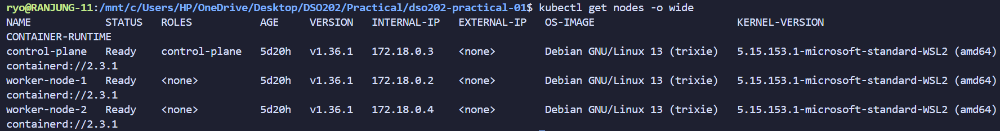

**What this shows:** All three nodes report `Ready`, run the same Kubernetes version, and use `containerd` as their container runtime, confirming the cluster is fully operational before any workloads are deployed.

---

**Step 3**

To read the particular node in detail, used describe to see its labels, capacity, and allocatable resources.

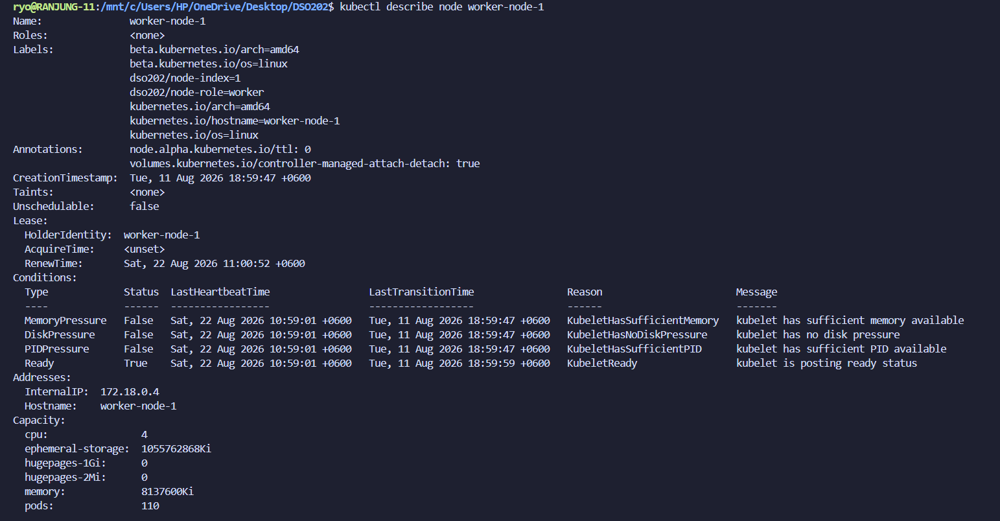

The result shows the nodes detailed information, including labels, capacity, and allocatable resources and the logs of the node.

**Step 4:**

Read the log of one control-plane component. 

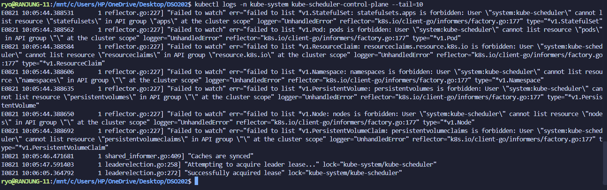

### Stage 3: Namespaces, Resource Quotas, and Limit Ranges

**Step 1**

First I created, listed and deleted a namespace to see the lifecycle of a namespace object. I have used the namespace `dso202-scratch` for this purpose.

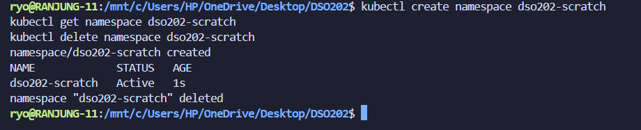

**Step 2:**

Then I created a namespace by using the imperative command with a name `dso202-practical-01` and then saved the output in a yaml file.

TO check the namespace was created successfully, I listed all namespaces.

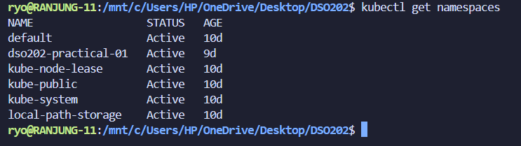

**What this shows:** The cluster shows with five default namespaces and the newly created namespace `dso202-practical-01`, confirming the namespace was created successfully.

**Step 3:**

Set the namespace as the default for the current context. Every subsequent command in this practical then omits -n.

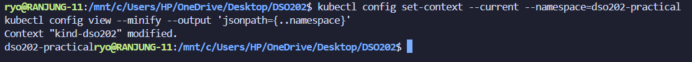

I have done this step because it is a good practice to set the namespace as the default for the current context. This avoids the need to specify the namespace in every command, reducing the risk of accidentally operating in the wrong namespace.

**Step 4:**

Then I created a ResourceQuota and LimitRange in the namespace, to see how they constrain the resources available to Pods.

To see the resource quota and limit range in details, I have used the describe command.

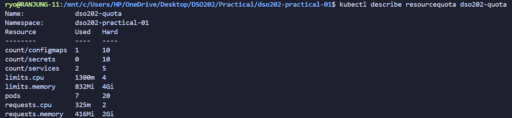

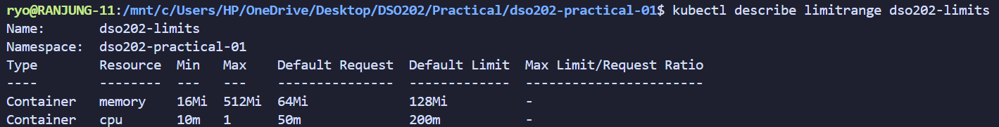

---

### 3.5 Stage 4: Pods

### The imperative way

**Step 1:** 

First, I created a pod imperatively with explicit labels, to see the imperative pod-creation form before moving to the declarative equivalent. There are two ways to create a pod imperatively: `kubectl run` and `kubectl create pod` and declared pods are created with `kubectl apply -f <manifest>`. I have used `kubectl run` to create the pod imperatively. 

**Command:**
```
kubectl run web-imperative --image=nginx:1.30-alpine --restart=Never --port=80 --labels='app=web,tier=frontend,managed-by=imperative'
kubectl get pod web-imperative --watch
```

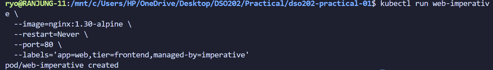

The pod transitioned from `ContainerCreating` to `1/1 Running` within seconds, confirming the image was pulled and the container started successfully.

---

**Step 2:** 

Captured the imperatively-created pod's full stored specification, to compare against the hand-written manifest used later.

**Command:**
```
kubectl get pod web-imperative -o yaml > evidence/web-imperative-as-stored.yaml
```

The output is saved in the file `evidence/web-imperative-as-stored.yaml`, which shows the full specification of the pod as stored in the cluster.

### The declarative route

**Step 1:** Applied the declarative pod manifest, then re-applied it unchanged, to demonstrate idempotency. We always need to apply the manifest file whenever we make the changes to the manifest file. This is the declarative way of creating the pod.

**Command:**
```
kubectl apply -f manifests/02-pod-web.yaml
kubectl apply -f manifests/02-pod-web.yaml
```
---

**Step 2:** 

On the manifest file, the defination of the pod was written in the declarative way. The pod was created successfully and the output shows the pod is created successfully.

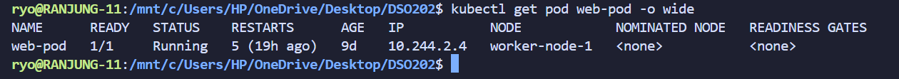

Confirmed the pod was created successfully by listing all pods in the namespace.

**Step 3:** 

The resourcequota and limitrange were applied to the namespace, so I have checked the pod's resource requests and limits to see how they were affected by those constraints.

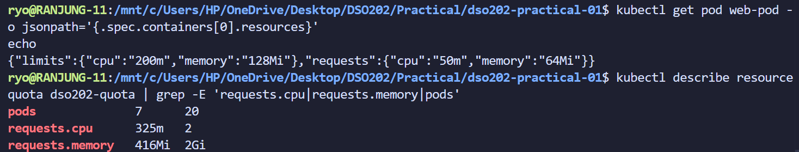

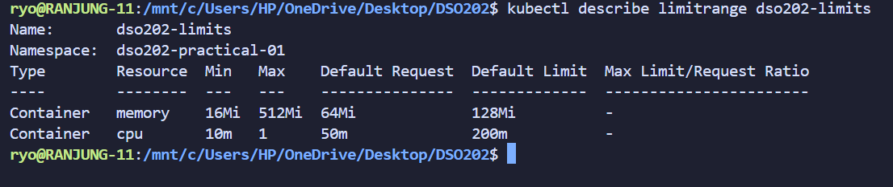

### Labels and selectors

Display labels alongside the Pod list.

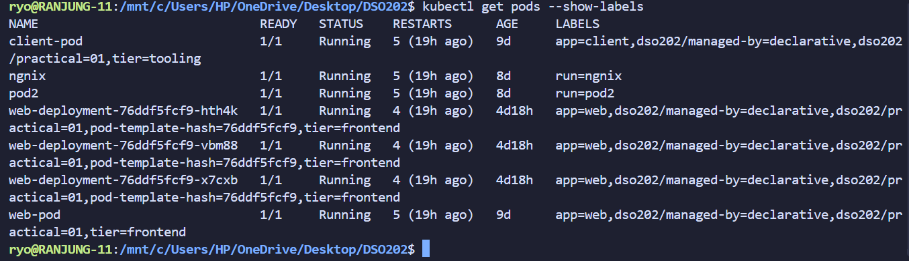

We can select Pods by label rather than by name.

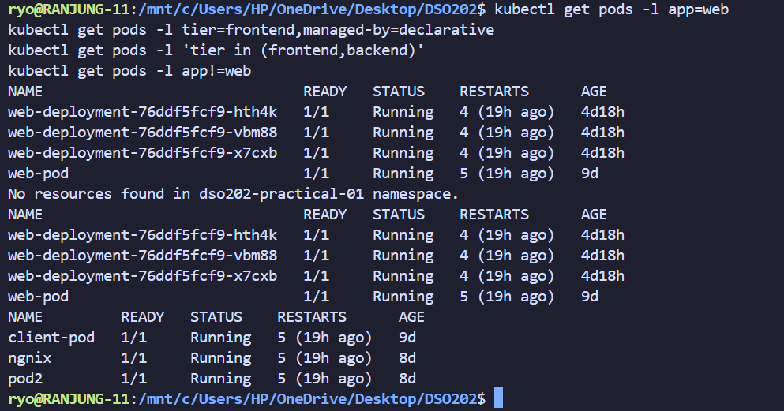

### Debugging and troubleshooting commands

we can open the shell inside the running container, to inspect the filesystem and run commands inside the container.

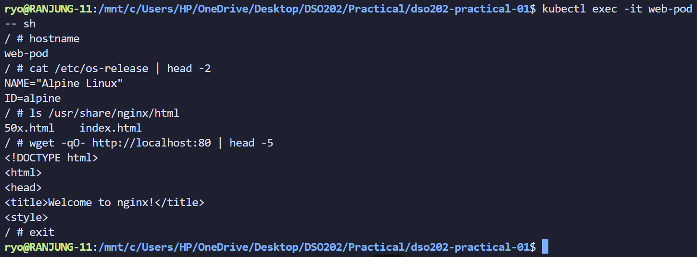

Forward a local port to the Pod. This opens a tunnel from the host, through the API server, to the Pod. It is intended for debugging, never for exposing an application.

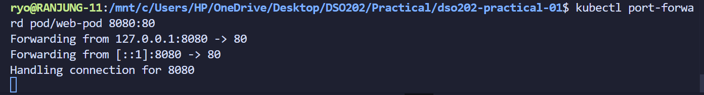

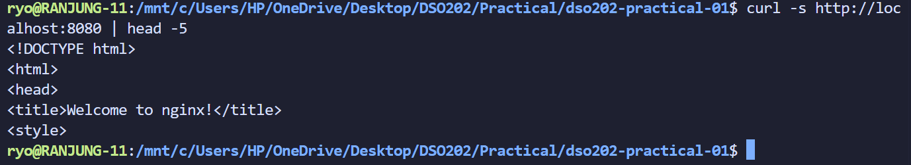

### Stage 5: Deployments

Same as before we can create a deployment imperatively or declaratively. 

First, I have created a deployment imperatively with explicit labels, to see the imperative deployment-creation form before moving to the declarative equivalent.

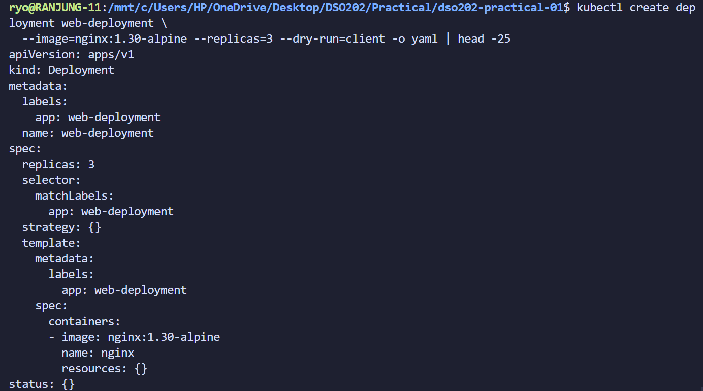

Then after that created a deployment declaratively with the manifest file `manifests/03-deployment-web.yaml`. The deployment was created successfully and the output shows the deployment is created successfully. We should apply when we are using the declarative way of creating the deployment.

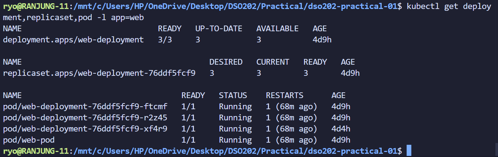

Result shows the deployment is created successfully and the deployment is running with 3 replicas.

**Note**

The key feature of kubernetes is self-healing. The deployment controller automatically replaces failed Pods to maintain the desired number of replicas. This ensures that the application remains available even in the face of failures.

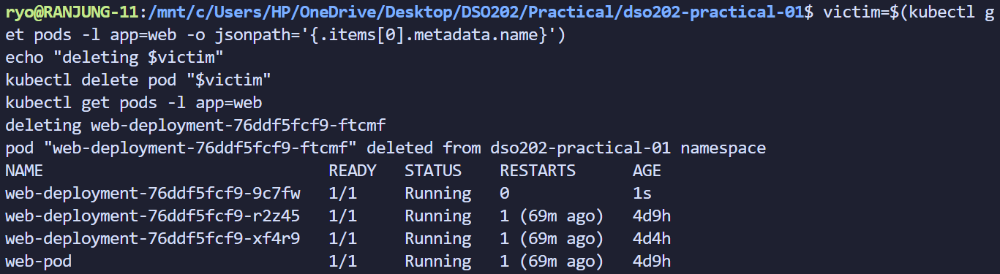

Even after deleting the pod, the deployment controller automatically replaces it to maintain the desired number of replicas.

#### Scaling

We can scale the deployment up or down by changing the number of replicas in the deployment manifest and re-applying it. The deployment controller will create or delete Pods as necessary to match the new desired state.

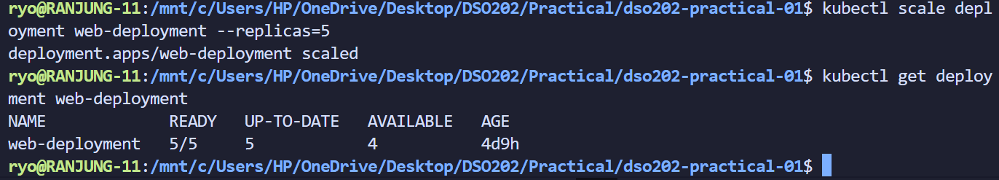

### Stage 6: Services

Here when creating the service, I have created it only using the declarative way. Created a 04-service-clusterip.yaml and defined all the defination of the service in the manifest file. The service was created successfully and the output shows the service is created successfully.

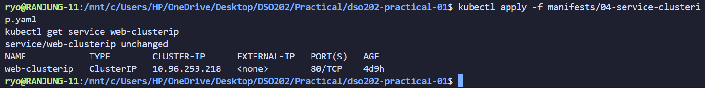

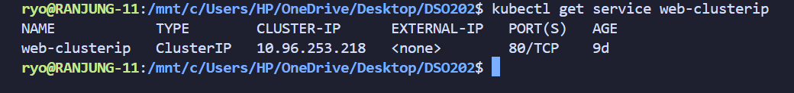

Resolve the Service name from inside the cluster.

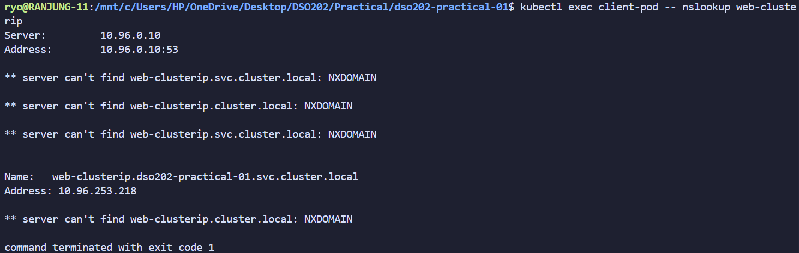

The answer is the Service's ClusterIP, not a Pod IP. 

We can send request through the Service.

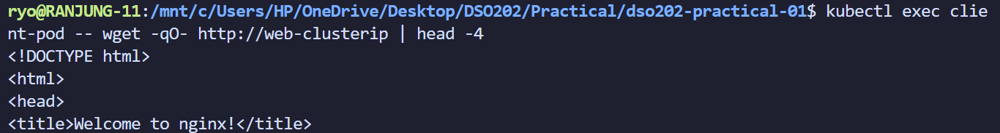

Here I have demonstrated load balancing. Each Pod's hostname is its Pod name, so writing a distinct page into each Pod makes the distribution visible.

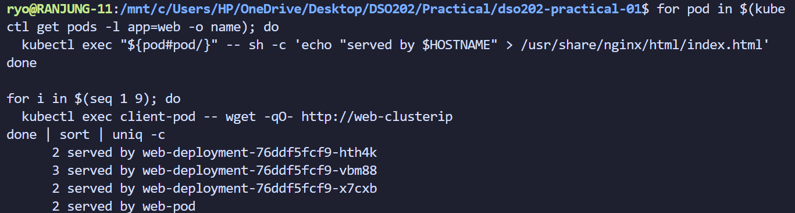

Then I have demonstrated the most common Service fault: a selector that matches nothing.

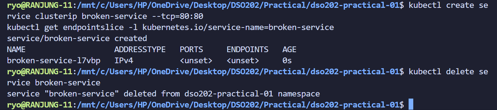

An empty EndpointSlice is the diagnostic signature of a selector mismatch. So, I removed it.

## Analysis

The practical showed how a Kubernetes cluster is organized and managed using kind. It shows the structure of the cluster and how different components interact with each other.

The control plane manages the cluster, while worker nodes run applications. In kind, these nodes run as Docker containers on the same computer, making it useful for learning and testing but less suitable for production.

The practical also demonstrated the difference between **imperative and declarative management**. Imperative commands such as `kubectl scale` make immediate changes, while YAML manifests define the desired state. We need to apply the manifest again to ensure that the desired state is maintained, as applying the manifest again can overwrite manual changes, which is why manifests are important for GitOps and consistent cluster management.

**ResourceQuota** limits the total CPU and memory used by a namespace, while **LimitRange** provides default resource values for individual containers. Together, they help control resource usage.

The **Deployment, ReplicaSet, and Pod** relationship demonstrated Kubernetes self-healing. When a pod was deleted, the ReplicaSet automatically created a replacement to maintain the desired number of replicas.

Finally, the practical showed why **Services** are needed. Pod IP addresses can change, so Services provide stable access to applications. Readiness probes ensure that only pods ready to handle traffic receive requests, even if the pods are still running.

## Reflection

Before doing this practical, I only know that the kubernetes has the ability to rollout and rollback the deployment. But after doing this practical. I knew that there are ways of doing it by using the maxUnavailable and maxSurge. The maxUnavailable is the maximum number of pods that can be unavailable during the update, while the maxSurge is the maximum number of pods that can be created above the desired number of pods during the update. 

The stage that I found most challenging was Stage 5, especially understanding why Kubernetes keeps the old ReplicaSet after a rolling update. But doing this practical helped me understand that the old ReplicaSet is kept for rollback purposes.

Doing this practical gave me the solid foundation of kubernetes and I still want to understand more about how the `kube-proxy` routes the traffic from a Service to the correct pods. I understand that the `kube-proxy` is optional in the worker note but it has it's own functionality. 
