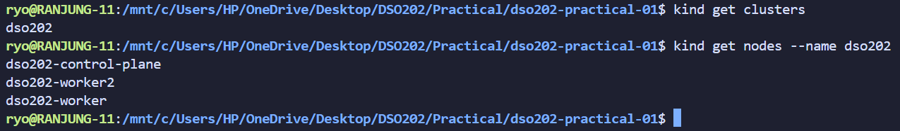
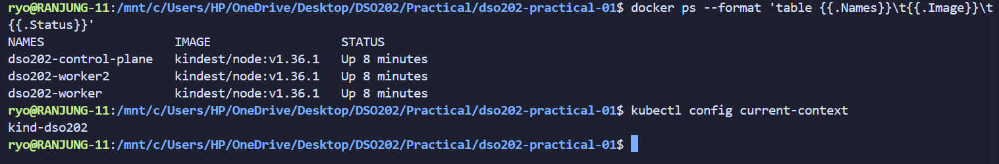

# DSO202: Practical 1

## Setting Up a Local Kubernetes Cluster with kind, and Deploying First Workloads


## Objective

The purpose of this practical was to build, from scratch, the local Kubernetes environment that every subsequent practical in DSO202 depends on, and to use that environment to create, inspect, break, and repair five categories of core Kubernetes object: Namespaces with ResourceQuotas and LimitRanges, Pods, Deployments, and Services.

Rather than working with a real application, the practical deliberately used a single static nginx web server throughout, so that the focus stayed on the behaviour of the Kubernetes objects themselves rather than on application code. This let each stage isolate one concept at a time, cluster topology, control-plane components, multi-tenancy primitives, Pod lifecycle, controller-managed workloads, and service discovery, while building toward a single working, self-healing, load-balanced deployment reachable both from inside and outside the cluster.

## 2. Environment

| Component | Version/Detail |
|---|---|
| Operating system | Linux (WSL2 backend used where applicable) |
| Docker Engine / Docker Desktop | 28.1.1 |
| kind | v0.32.0 (go1.24.4, linux/amd64) |
| kubectl (client) | v1.36.0 |
| Kustomize (bundled with kubectl) | v5.7.1 |
| Kubernetes cluster version | v1.36.1 |
| Cluster topology | 1 control-plane node + 2 worker nodes |
| Container runtime | containerd 2.1.4 |
| CNI | kindnet (default) |
| Default StorageClass provider | local-path-storage (added by kind) |

## 3. Procedure and Observations

In this section I have worked through the practical in the order it was performed. Each entry follows the same four-part format: **what was done** (the action and why it was taken), the **command** that was run, the **screenshot** captured as evidence of the output, and **what the output shows** a single sentence interpreting the result rather than just restating it. Screenshots are referenced by filename as saved in `evidence/`; insert the actual image under each placeholder.

---

### 3.2 Stage 1: Creating the Three-Node Cluster

**What was done:** Here  I have created the three-node cluster from the configuration file committed at `cluster/kind-cluster.yaml`. I have copied the manifest file from the kind cluster configuration walkthrough and applied the fileto create a cluster.

**Command:**
```
kind create cluster --config cluster/kind-cluster.yaml
```


**What this shows:** This shows that the kind successfully provisioned a control-plane node and joined two worker nodes, installed the CNI and default StorageClass, and set the kubectl context to `kind-dso202` automatically.

---

**What was done:** Confirmed kind itself recognised the new cluster and listed the nodes belonging to it.

**Command:**
```
kind get clusters
kind get nodes --name dso202
```


**What this shows:** The cluster `dso202` exists and consists of exactly three nodes, one control plane and two workers, matching the design in Listing 1.

---

**What was done:** Cross-checked the same three nodes as Docker containers, to confirm the mapping between a kind "node" and the underlying Docker container that implements it.

**Command:**
```
docker ps --format 'table {{.Names}}\t{{.Image}}\t{{.Status}}'
```


**What this shows:** Each Kubernetes node is running as a separate Docker container from the `kindest/node` image, all in an `Up` status.

---

**What was done:** Confirmed kubectl had been pointed at the correct context without any manual configuration.

**Command:**
```
kubectl config current-context
```


**What this shows:** The active context is `kind-dso202`, meaning every subsequent kubectl command in this practical is talking to the correct cluster by default.

---